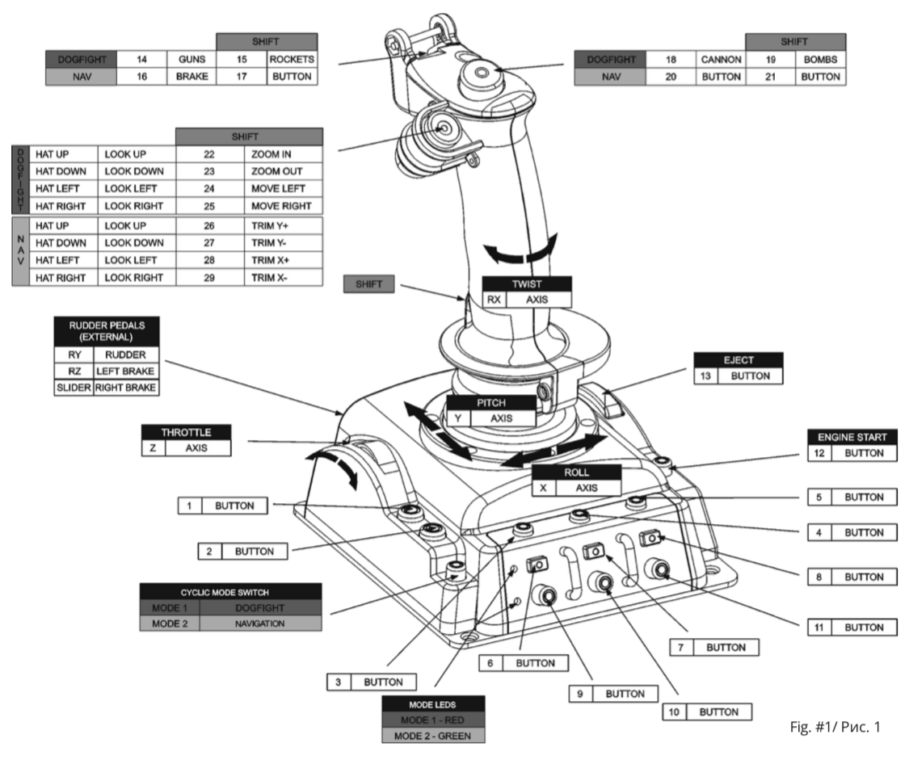

# GIMX HOTAS

I want to play [Elite Dangerous](https://www.elitedangerous.com/) on my PS4 with a [HOTAS controller](https://en.wikipedia.org/wiki/HOTAS). [The](https://www.thrustmaster.com/en_US/products/tflight-hotas-4) [two](https://www.amazon.com/Combat-Hotas-Flight-Stick-PlayStation-4/dp/B01A0P8NBC) PS4 HOTAS that are available on the market are garbage based on their reviews. I would like to instead use something like the [Logitech G X56 RGB](https://camelcamelcamel.com/product/B079P6SSHP) which mandates a translation layer between the controls and the PS4. That translation layer is provided by [GIMX](https://blog.gimx.fr/) running on a Raspberry Pi.

## Connection Options

1. USB adapter
	- https://gimx.fr/wiki/index.php?title=DIY_USB_adapter
	- https://gimx.fr/wiki/index.php?title=DIY_USB_adapter_for_dummies

## Hardware

1. USB Adapter
	- https://www.amazon.com/PJRC-LYSB01LZ98KUX-ELECTRNCS-Teensy-with-pins/dp/B01LZ98KUX/ref=sr_1_13?dchild=1&keywords=Teensy+2.0+w%2F+pins&qid=1590504252&sr=8-13

## Elite Dangerous Commands/Mappings

### References

- https://vignette.wikia.nocookie.net/elite-dangerous/images/9/9a/Elite-Dangerous-X55-HOTAS-%2B-GamePad-3.3-Keybinds.png/revision/latest?cb=20181217151944

### Needed

> Here's my plan. I'm gonna map these necessary buttons so I can play and then as I play I'll feel out what works, what doesn't, and what would be nice to have.

- Deploy hardpoints
- Toggle cargo scoop
- Toggle landing gear
- Toggle alternate flight controls
- Menu navigation (D-pad, R1, L1, Cross, and Circle at a minimum; probably need Triangle and Square too)
- Open pause menu
- PS button
- Supercruise
- FSD drive
- Reverse thruster
- Target

### Wanted

- Request docking permissions
- Easy UI panel opening (maybe with the D-pad/hat)
- Night vision
- Head look

### Wishlist

- Toggle flight assist
- Launch chaff
- Launch heat sink
- Launch limpets

## Button Mappings

### DualShock 4

- Cross = 0
- Circle = 1
- Triangle = 2
- Square = 3
- L1 = 4
- R1 = 5
- L2 = 6
- R2 = 7
- Share = 8
- Options = 9
- PS = 10
- L3 - 11
- R3 - 12

#### D-pad

- Up = 13
- Right = 14
- Down = 15
- Left = 16

#### Virtual Touchpad

> I create fake joystick buttons with GIMX macros to simulate the four quadrants of the DualShock touchpad.

- Northeast - 17
- Southeast - 18
- Southwest - 19
- Northwest - 20

## VKB Gladiator MK II

